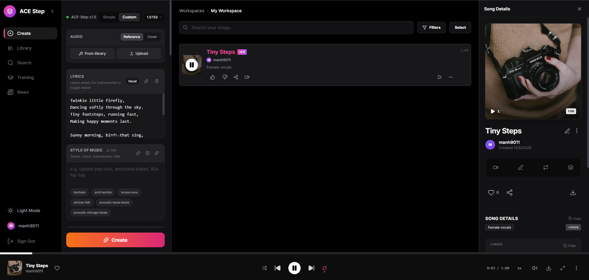

# 🎵 ACE-Step UI Colab

> Run ACE-Step UI directly on Google Colab with automatic setup and public Web UI access.

This notebook installs dependencies automatically and launches the ACE-Step UI entirely inside Google Colab without requiring local installation.

---

# 🚀 Features

- ✅ One-click Google Colab setup
- ✅ Automatic dependency installation
- ✅ Automatic model download
- ✅ Public Web UI access
- ✅ Works on free Colab GPU
- ✅ ACE-Step music generation UI
- ✅ Simple startup process
- ✅ No local CUDA setup required

---

# 📋 Requirements

- Google account
- Google Colab
- GPU runtime enabled

Recommended GPUs:

| GPU  | Status |
|------|--------|
| T4   | ✅ Recommended |
| L4   | ✅ Fast |
| A100 | ✅ Best |
| CPU  | ❌ Not recommended |

---

# ⚡ Quick Start

## 1. Open Notebook

Open the notebook:

👉 https://github.com/manh9011/ace-step-ui-colab/blob/main/ace_step_ui.ipynb

---

## 2. Enable GPU

In Colab:

`Runtime → Change runtime type → GPU`

---

## 3. Run Cells

Run notebook cells from top to bottom.

The notebook will automatically:

- Install dependencies
- Clone repositories
- Download models
- Start ACE-Step UI
- Create public Web UI URL

First startup may take several minutes.

---

## 4. Open Web UI

After startup you will see a public URL similar to:

```txt
https://*.prod.colab.dev
